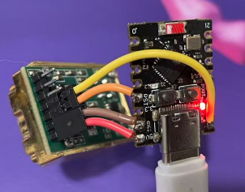
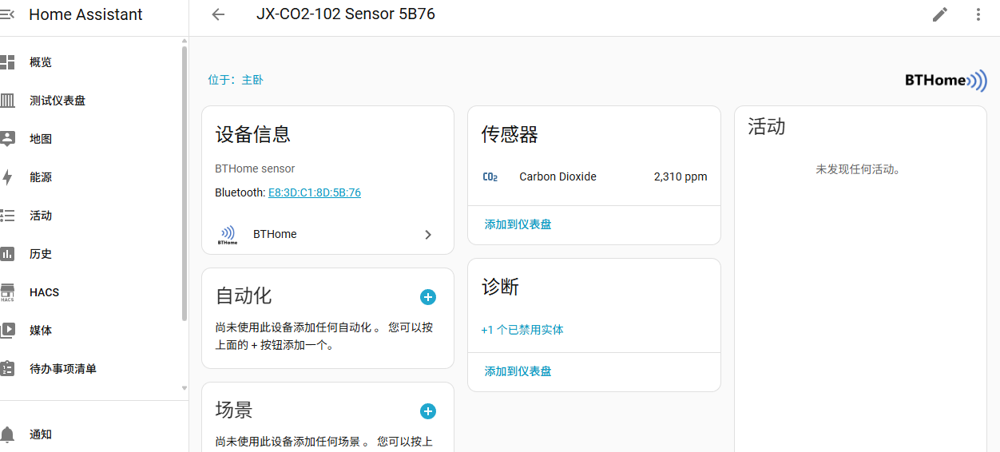

# JX-CO2-102 BLE CO2 传感器

ESP32-C3 固件，通过 UART 读取 JX-CO2-102 NDIR CO2 传感器数据，以 BTHome v2 格式通过 BLE 广播，Home Assistant 自动发现 CO2 实体。同时提供 BLE GATT Server，支持通过 nRF Connect 手机 App 配置设备参数。

## 硬件

| 组件 | 说明 |
|---|---|
| 主控 | ESP32-C3 |
| 传感器 | JX-CO2-102（NDIR，0–5000 ppm） |
| UART | UART1，RX=GPIO4，TX=GPIO5，9600 8N1 |
| 校准按钮 | BOOT 按钮（GPIO9，active-low） |

接线参考：



## 功能

- **BTHome v2 BLE 广播** — CO2 数据自动被 Home Assistant 发现，无需额外配置
- **可配置上报间隔** — 默认 5 分钟更新一次 BLE 广播（节省功耗）
- **BLE GATT 配置** — 通过 nRF Connect 连接后可修改以下参数：
  - 上报间隔（1–3600 秒）
  - 传感器 24h 自动校准开关
  - 传感器通讯模式（主动上报 / 被动问询）
- **手动校准** — BOOT 按钮或 GATT 写入均可触发零点校准
- **掉电配置恢复** — 参数保存在 NVS，上电后自动重放给传感器

## 编译与烧录

```sh
idf.py set-target esp32c3
idf.py build
idf.py -p <PORT> flash monitor
```

退出 monitor：`Ctrl-]`

## Home Assistant

需要 HA Bluetooth 集成或 Bluetooth Proxy。设备上电后自动出现在 HA 设备列表：



## nRF Connect 配置指南

### 连接步骤

1. 打开 nRF Connect → **Scanner**
2. 找到 `JX-CO2-102 Sensor` → **Connect**
3. 进入 **Client** 标签 → 展开自定义 Service

**Service UUID:** `12345678-1234-1234-1234-123456789012`

### Characteristic 操作

| Characteristic | UUID 末尾 | 属性 | 操作说明 |
|---|---|---|---|
| Calibrate | `...01` | Write | 写 `01` 触发零点校准 |
| Report Interval | `...02` | Read/Write | uint16 小端序，单位秒 |
| Auto Calibration | `...03` | Read/Write | `00`=关闭，`01`=开启 |
| Comm Mode | `...04` | Read/Write | `01`=主动上报，`02`=被动问询 |

### 常用写入值

**Report Interval（上报间隔）：**

| 间隔 | 写入字节 |
|---|---|
| 60 秒 | `3C 00` |
| 300 秒（5 分钟） | `2C 01` |
| 600 秒（10 分钟） | `58 02` |
| 3600 秒（1 小时） | `10 0E` |

**Auto Calibration（自动校准）：**
- 开启：写 `01`
- 关闭：写 `00`

> 注意：自动校准适用于室外或通风良好环境（CO₂ ≈ 400 ppm），不适用于农业大棚、养殖场等高浓度封闭场所。

**Comm Mode（通讯模式）：**
- 主动上报：写 `01`（传感器每秒推送 ASCII 数据）
- 被动问询：写 `02`（ESP32 按 report_interval 主动查询，MODBUS RTU）

### 配置完成

断开连接后，设备自动恢复 BLE 广播，所有参数已保存到 NVS，下次上电自动生效。

## BLE 广播格式（BTHome v2）

AD Type: Service Data（UUID16 `0xFCD2`）

```
D2 FC  — UUID 0xFCD2（小端序）
40     — BTHome v2，未加密（info byte）
12     — Object ID: CO2
LL HH  — CO2 浓度 ppm，uint16 小端序
```

## 项目结构

```
main/
  main.c              应用主入口，UART 任务，按钮任务，UART 命令
  src/
    gap.c             BLE GAP 广播管理，BTHome v2 payload 构建
    gatt.c            BLE GATT Server，4 个 characteristics
    nvs_config.c      NVS 配置读写
  include/
    common.h          公共头文件，TAG，DEVICE_NAME
    gap.h             GAP 接口
    gatt.h            GATT 接口
    nvs_config.h      配置结构体与接口
```

## 配置修改

| 参数 | 位置 |
|---|---|
| UART 引脚 / 波特率 | `main/main.c` — `CO2_UART_*` |
| 设备名称 | `main/include/common.h` — `DEVICE_NAME` |
| 默认上报间隔 | `main/src/nvs_config.c` — `DEFAULT_INTERVAL` |
| 默认自动校准 | `main/src/nvs_config.c` — `DEFAULT_AUTO_CAL` |
| 默认通讯模式 | `main/src/nvs_config.c` — `DEFAULT_COMM_MODE` |

## 文档

- [实现方案设计](docs/PLAN.md)
- [传感器使用说明书（PDF）](docs/JX_CO2_102%20小型二氧化碳传感器使用说明书.pdf)
- [传感器使用说明书（MD）](docs/JX-CO2-102-Sensor-User-Guide.md)

## 故障排查

| 现象 | 排查方向 |
|---|---|
| HA 无 CO2 实体 | 确认 BTHome 集成已启用，Bluetooth Proxy 可达 |
| 数值异常 | 检查 UART 接线（传感器 TX→ESP RX4，传感器 RX←ESP TX5） |
| nRF Connect 无法连接 | 确认设备未处于连接状态（同时只支持一个连接） |
| 上电后数值为 0 | 传感器预热需约 1 分钟，等待第一个 report_interval 后更新 |
